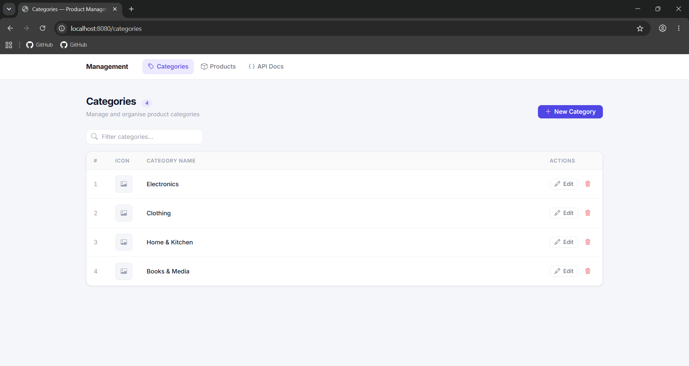
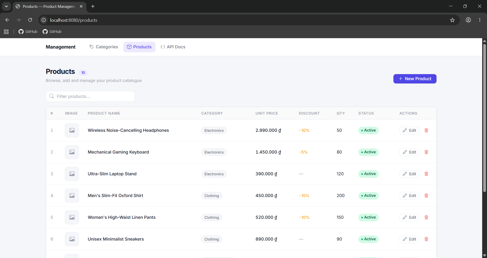
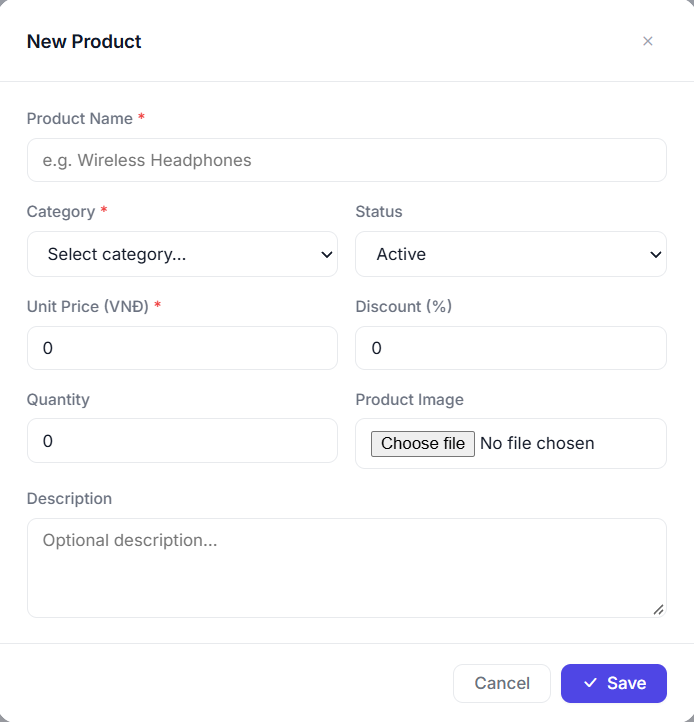
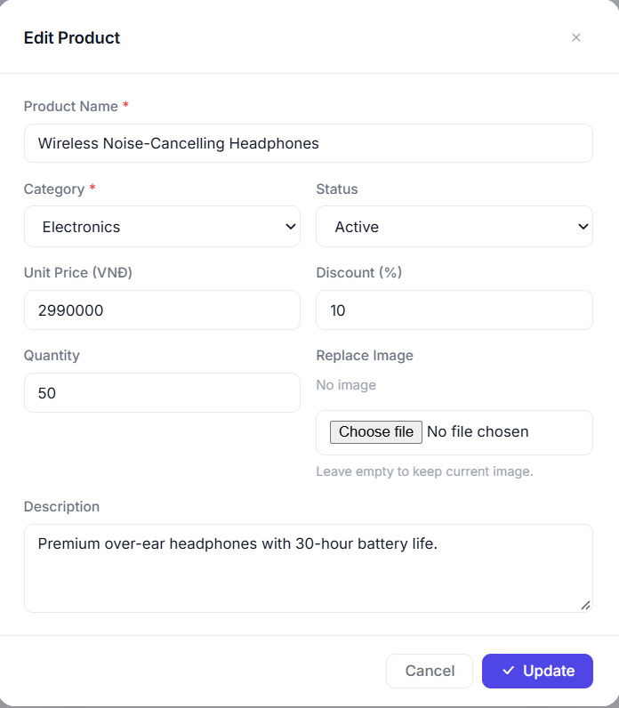
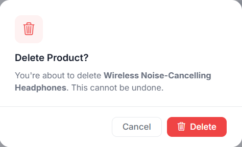
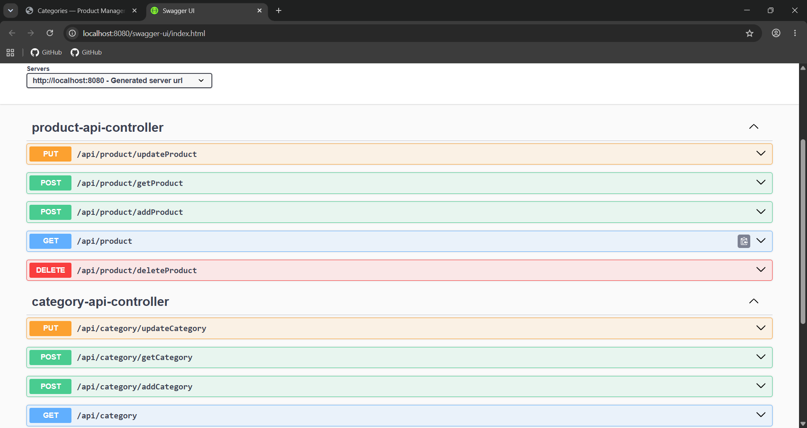

# Web Assignment 7

> Student: Lý Võ Mỹ Hoa - 24133017

## URLs

- Products Management: [http://localhost:8080/products](http://localhost:8080/products)
- Category Management: [http://localhost:8080/categories](http://localhost:8080/categories)
- Swagger OpenAPI Docs: [http://localhost:8080/swagger-ui/index.html](http://localhost:8080/swagger-ui/index.html)
- Category REST API: [http://localhost:8080/api/category](http://localhost:8080/api/category)
- Product REST API: [http://localhost:8080/api/product](http://localhost:8080/api/product)

## Screenshots

### Category Management

### Product Management

### Create Product / Category

### Update Product / Category

### Delete Confirmation

### Swagger 3 / OpenAPI Documentation

